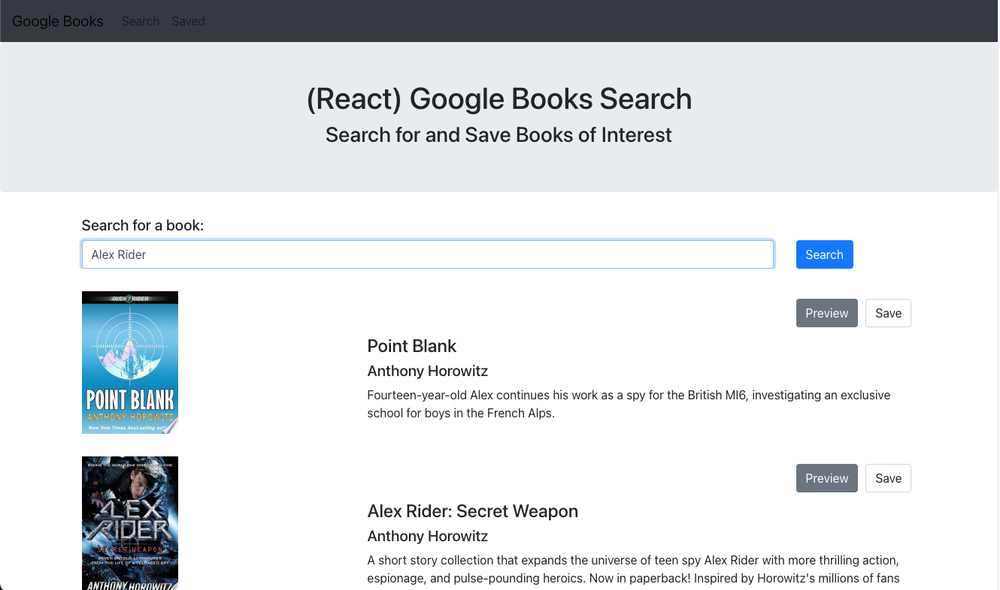
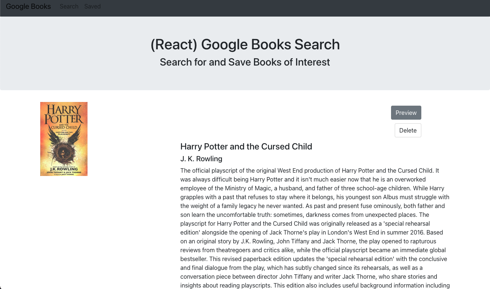

# Google Book Search

---

## _Links_

[GitHub Repository](https://github.com/kpegeder/google-book-search)

[Live Site](https://google-books01.herokuapp.com/)

---

## Description

A MERN app that allows an user to search, preview and save books from Google. There are two pages to navigate. The homepage which allows the user to search books and save the book. The second pages is where all of the saved books will be located. On this page, the book can be removed from the list of saved books. The search will use the Google Books API to find a book which will be stored via MongoDB.

### Table of Contents

- [Technologies](#technologies)
- [Usage](#usage)
- [License](#license)
- [Questions](#questions)

### Technologies

1. MongoDB
2. Express
3. React
4. Node

### Usage

The homepage displays the search bar and results from the users searched.

The saved page will display all of the books that are saved to MongoDB.

### Contributing

[Kalen Pegeder](https://github.com/kpegeder)

### License

Licensed under the MIT license.

### Questions

If you have any additional questions about the applictaion, you can contact through [email](mailto:k.pegeder@gmail.com).
You can see more of my work on [GitHub](https://github.com/kpegeder).
